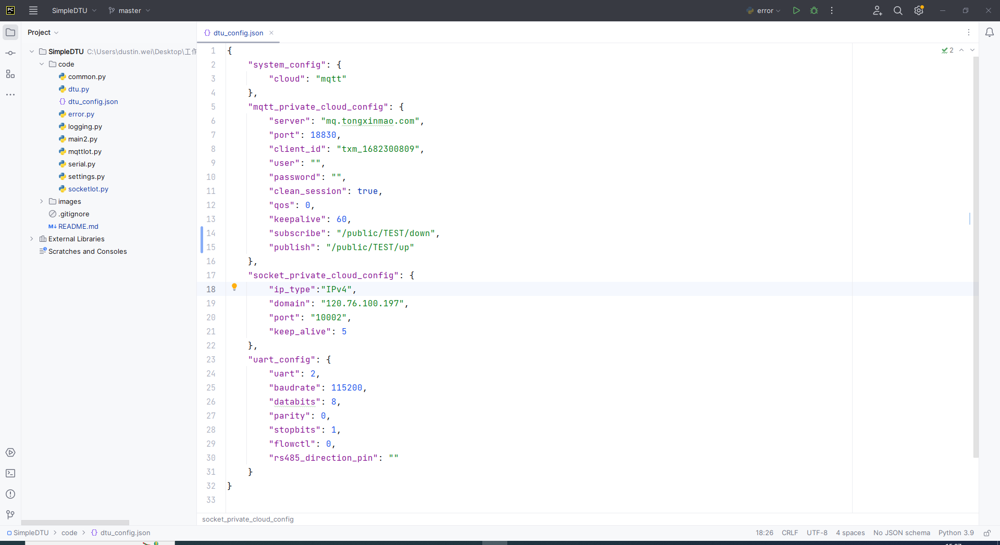
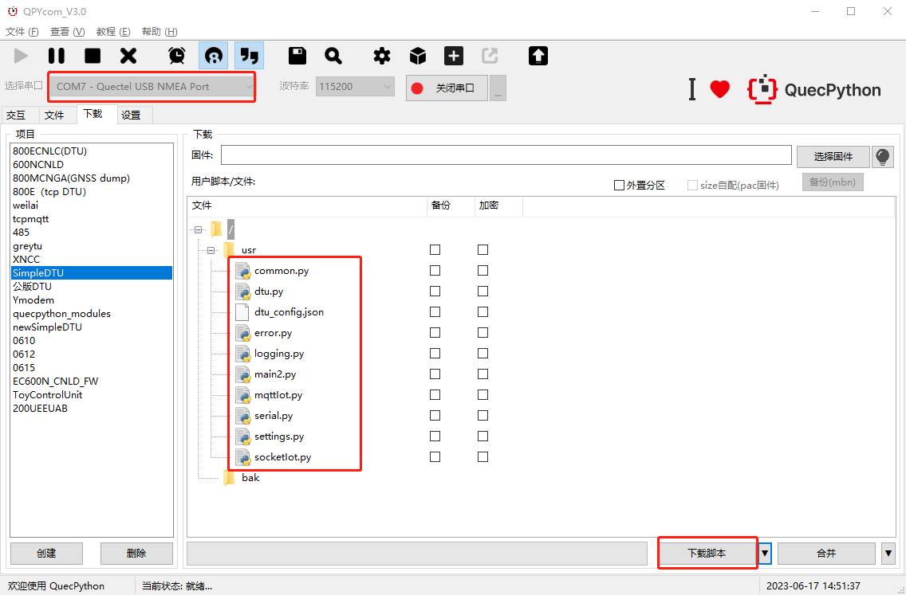
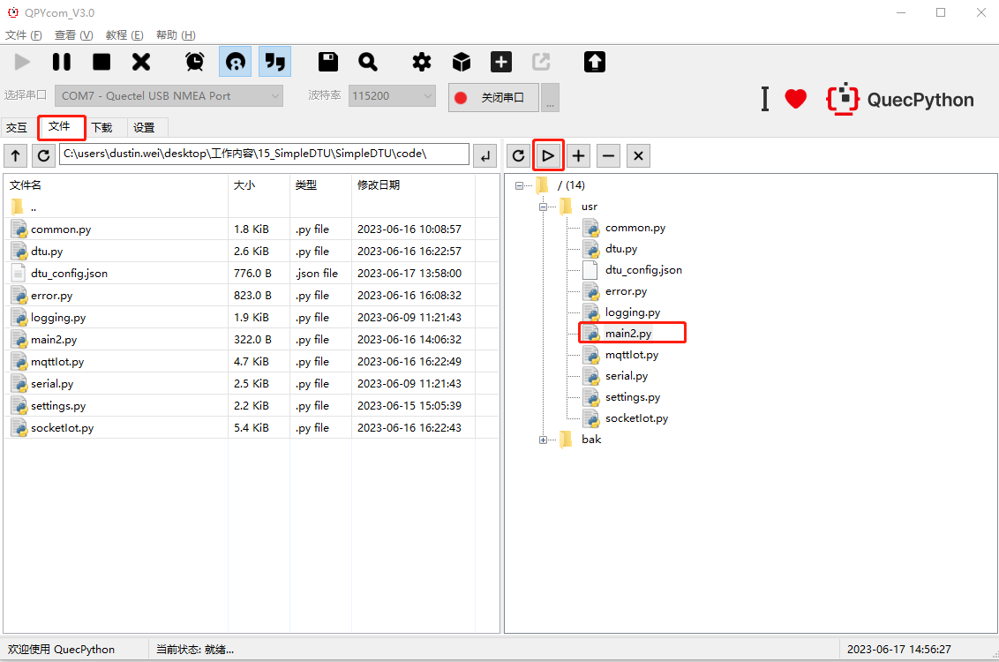
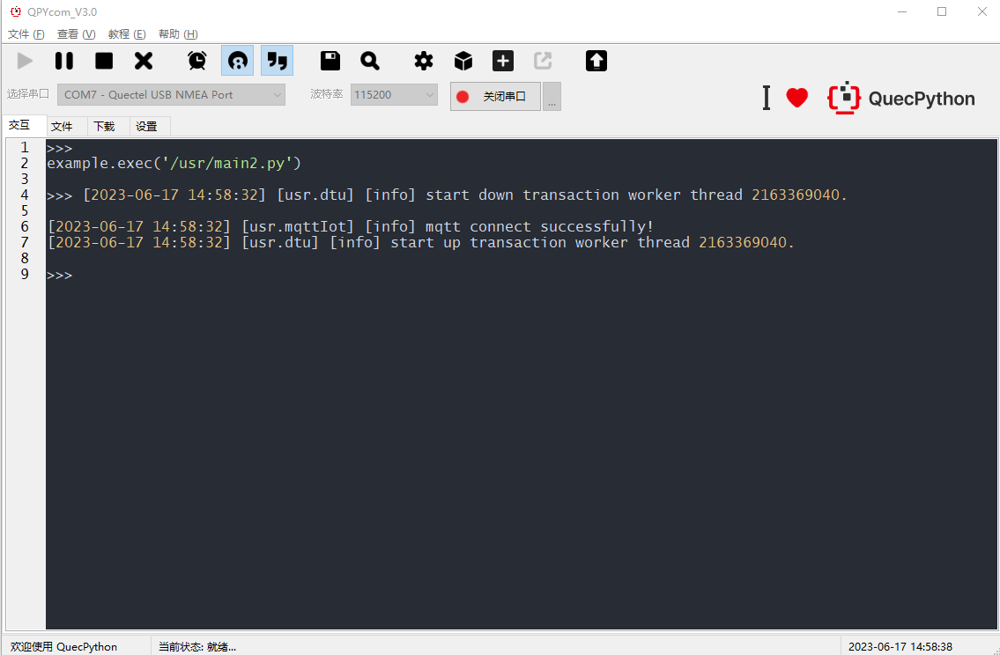
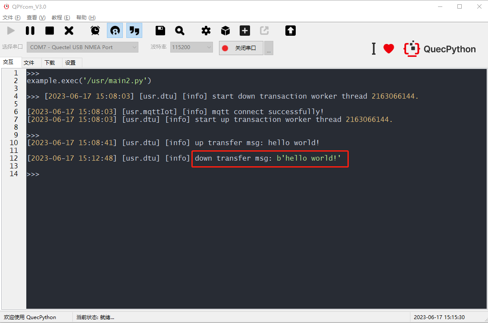
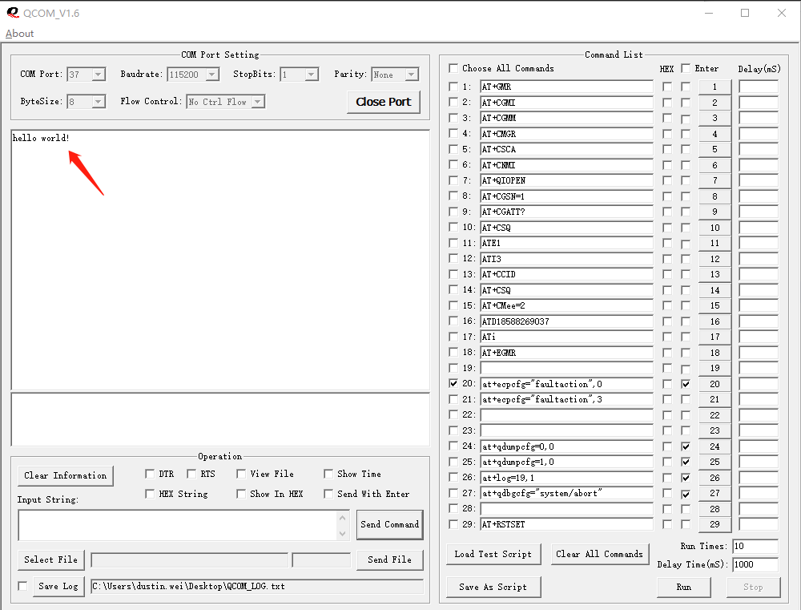
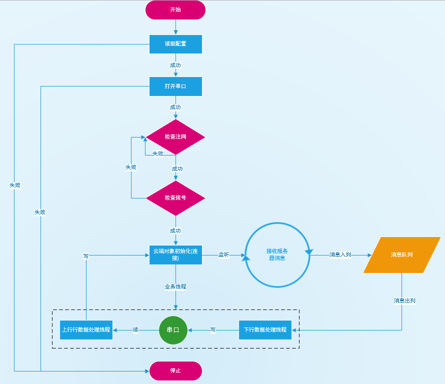

# SimpleDTU Getting Started Guide

[中文](./README_ZH.md) | English

## I. Overview

SimpleDTU is a straightforward data transmission unit that supports pure data transmission over TCP and MQTT.

This document aims to guide users on how to develop SimpleDTU functionalities using our QuecPython development board.

## II. Feature List

| Feature  | Notes        |
| -------- | ------------ |
| TCP Transmission  | Single connection transmission |
| MQTT Transmission | Single topic transmission |
| Parameter Configuration | —— |

## III. Application Guide

### 1. Preparations

Hardware Preparations:

- A development board (`QuecPython_EC2X_EVB` or `Open EVB`)
- **USB Data Cable** (USB-A TO USB-C)
- **PC** (Windows 7, Windows 10, or Windows 11)

Software Preparations:

- Download and install the **USB driver** for developing and debugging QuecPython modules.
- Download the **QPYcom Debugging Tool** — a comprehensive development and debugging tool for QuecPython.
- Download the **QCOM Serial Debugging Tool** — used to simulate the MCU.
- Obtain and download **QuecPython** firmware and related software resources.
- Install a **text editor** for Python, such as [VSCode](https://code.visualstudio.com/) or [Pycharm](https://www.jetbrains.com/pycharm/download/).

You can download drivers, tools, firmware, and other resources from: https://python.quectel.com/download

### 2. Hardware Selection

#### 2.1 `Open EVB` Development Board

Using the `Open EVB` development board with the `EC600N-CN-TEA` module.


> Notes:
>
> 1. Insert the SIM card into the SIM card slot.
> 2. Connect the antenna.
> 3. Use a USB data cable to connect the development board to the computer's USB port.
> 4. Connect the serial port to the PC via a TTL to USB module.

#### 2.2 `QuecPython EVB` Development Board

Using the `QuecPython_EC2X_EVB_V2.0` development board with the `EC200U` module (Introduction to EC2X development board: https://python.quectel.com/doc/Quick_start/zh/EC2X_BOARD.html).

Power the module via a type-C connection, and connect the UART to the TTL to USB module as shown below (for reference only).

| PIN on Development Board | TTL to USB Module | Wire Color |
| ------------------------ | ----------------- | ---------- |
| J7 Pin 13 (TX)           | RX                | Red        |
| J7 Pin 14 (RX)           | TX                | Orange     |
| J7 Pin 3 (GND)           | GND               | Yellow     |


> Notes:
>
> 1. Insert the SIM card into the SIM card slot.
> 2. Connect the antenna.
> 3. Use a USB data cable to connect the development board to the computer's USB port.
> 4. Connect the serial port to the PC via a TTL to USB module.

### 3. Software Preparation

#### 3.1 Obtaining the Project Code

The project code repository for this experiment: `https://github.com/QuecPython/SimpleDTU`.

#### 3.2 Writing the Configuration File

DTU configuration file path: `code/dtu_config.json`.

For this experiment, configure it as follows based on the MQTT private cloud:



> Parameter Descriptions:
>
> `system_config.config`: Specifies the type of private cloud currently in use. Currently supports TCP and MQTT.
>
> `mqtt_private_cloud_config`: MQTT private cloud configuration.
>
> `socket_private_cloud_config`: TCP private cloud configuration.
>
> `uart_config`: Serial port parameter configuration.

#### 3.3 Downloading Code to the Device

Launch the QPYcom debugging tool and follow these steps.

Steps:

- Connect the data cable to the computer.
- Briefly press the **PWRKEY** button on the development board to start the device.
- Select and open the serial port.
  - For the `EC600N` module, select the `Quectel USB MI05 COM Port`.
  - For the `EC200U` module, select the `Quectel USB NMEA Port`.
- Select the `Download` tab, create a new project (name it as desired), right-click on the `/usr` directory on the right side, select `One-Click Import`, and choose the `code` directory to import the application script code in one click.



#### 3.4 Starting the DTU Service

Run `main2.py` to start the DTU service.

> Note: If you rename `main2.py` to `main.py`, the script will automatically execute and run the service when the module is powered on.

Steps:

- Select the `File` tab.
- Select the `main2.py` application main script.
- From the right-click dropdown menu on the main script, select `Run` or click the run shortcut button at the top to run.



The DTU service has two threads to handle data: one for detecting and reading serial port data and forwarding it to the cloud, and one for detecting downstream data from the cloud and transmitting it to the serial port, as shown below.



### 4. Data Transmission Demonstration

Use the **QCOM Serial Debugging Tool** to simulate data transmission.

#### 4.1 Upstream Data Transmission

Use the serial debugging tool to simulate the MCU sending upstream data to the module.

- Enter the string `hello world!` in the `Input String` input box.
- Click the `Send Command` button to send the data via the serial port.


QpyCom log output.

- The DTU receives the serial port data and transmits it directly.


Cloud receives upstream data log.


#### 4.2 Downstream Data Transmission

Cloud sends downstream data.

- Set the cloud downstream data topic (consistent with the subscription topic configured in the DTU application).
- Enter the downstream data.
- Publish.


DTU downstream data log.



Use the serial debugging tool to simulate the MCU receiving downstream data from the module.



## IV. Development Guide

### 1. Overview

SimpleDTU is a straightforward data transmission unit that currently supports pure data transmission over TCP and MQTT. The DTU application has two core threads: **Upstream Data Processing Thread** and **Downstream Data Processing Thread**, with data exchanges between the application and cloud objects decoupled using **queues**.

### 2. Application Flowchart



> Flow Description:
>
> 1. Read the configuration file: `code/dtu_config.json`.
> 2. Open the serial port: Open the serial port according to the `uart_config` configuration parameters in the configuration file.
> 3. Check network registration: If it fails, recheck every 20 seconds until successful.
> 4. Check dialing: If it fails, redial every 20 seconds until successful.
> 5. Connect to the cloud: When the cloud receives a downstream message, it will place the message in a queue for subsequent business threads to read.
> 6. Start business threads.
>    1. Upstream Data Processing Thread: Monitors and reads upstream data sent by the MCU via the serial port and sends it to the cloud.
>    2. Downstream Data Processing Thread: Monitors and reads downstream data from the cloud queue and sends it to the MCU via the serial port.

### 3. Directory Structure

```shell
- code
	- common.py			Common utilities
	- dtu.py			DTU application class implementation
	- dtu_config.json	Template configuration file
	- error.py			Error codes and descriptions
	- logging.py		Logging
	- main2.py			Application main script (demo)
	- mqttIot.py		MQTT client implementation
	- serial.py			Serial port read/write implementation
	- settings.py		Configuration file read/write implementation
	- socketIot.py		TCP client implementation
```

### 4. Getting Started

Create a new application main script, such as `main2.py`.

Import `usr.dtu.DTU` and `usr.settings.ConfigureHandler`.

Use `ConfigureHandler` to construct a configuration object (refer to `dtu_config.json` for the configuration file template) and use it as the initialization parameter for the `DTU` object. Construct the DTU object and run the instance using the `run` method of the DTU object.

It is recommended to write a factory function to construct the DTU application object, as follows:

```python
from usr.dtu import DTU
from usr.settings import ConfigureHandler


def create_app(config_path):
    config = ConfigureHandler(config_path)
    dtu = DTU(config)
    return dtu


app = create_app('/usr/dtu_config.json')


if __name__ == '__main__':
    app.run()
```

Download all scripts including `main2.py` into the module and start the application main script (refer to Chapter IV: `4. Application Guide`).

### 5. Error Codes

If an application error occurs, such as a network connection interruption causing cloud read/write errors, it will return an error message (in JSON format) to the MCU, such as: `{"code": 1, "desc": "connect error."}`. Detailed definitions can be found in the `error.py` module.

| Error Code | Description               |
| ---------- | ------------------------- |
| 0x01       | connect error.            |
| 0x02       | subscribe error.          |
| 0x03       | listen error.             |
| 0x04       | publish error.            |
| 0x05       | network status error.     |
| 0x06       | set socket option error.  |
| 0x07       | tcp send data error.      |

## V. Documentation Summary

| Document Description                     | Link                                                         |
| ---------------------------------------- | ------------------------------------------------------------ |
| QuecPython Official Wiki (API references) | https://python.quectel.com/doc/API_reference/zh/index.html   |
| QuecPython Getting Started Guide         | https://python.quectel.com/doc/Quick_start/zh/index.html     |
| Resource Downloads (firmware, tools, drivers, etc.) | https://python.quectel.com/download                          |
| DTU Product Introduction                 | https://python.quectel.com/doc/Product_case/zh/dtu/DTU_Product_Introduction.html |
| EC2X Development Board Introduction      | https://python.quectel.com/doc/Quick_start/zh/EC2X_BOARD.html |
| EC200U-CN Module Introduction            | https://python.quectel.com/products/ec200u-cn                |

## VI. Frequently Asked Questions

1. Serial Communication Issues.

> Q: After connecting the serial port to the PC via a TTL to USB module, the QCOM serial debugging tool cannot receive or send data.
>
> A: You can usually check as follows:
>
> - Check if QCOM has selected the correct port.
> - Check if the wiring is correct: the module's RX connects to the TTL to USB device's TX, and the module's TX connects to the TTL to USB device's RX.
> - Check if the QuecPython serial port number configured in the application code is correct. Refer to: `https://python.quectel.com/doc/API_reference/zh/QuecPython_classlib/machine.UART.html` for the UART list available for different modules.

2. Network Issues

> Q: Network connection error.
>
> A: You can determine it via the return value of the `waitNetworkReady` function in `checkNet`. For details on what the return value means, refer to: `https://python.quectel.com/doc/API_reference/zh/QuecPython_classlib/checkNet.html`

3. MQTT Connection Issues

> Q: The MQTT connection keeps reconnecting after being successfully connected.
>
> A: If there are multiple clients with the same ID connecting simultaneously, the server will kick off the previous connection. Check if there are clients using the same client ID.
>
> Q: The MQTT connection is successful but gets disconnected by the server after a while.
>
> A: Check if the client has a heartbeat. Different service providers have specific requirements for heartbeat intervals. Set it according to the service provider's documentation.