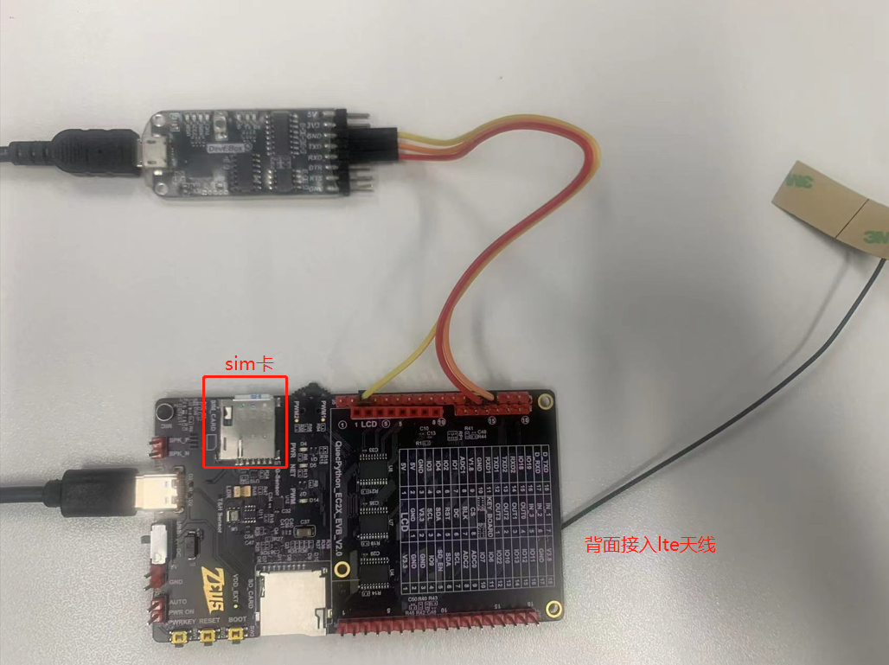
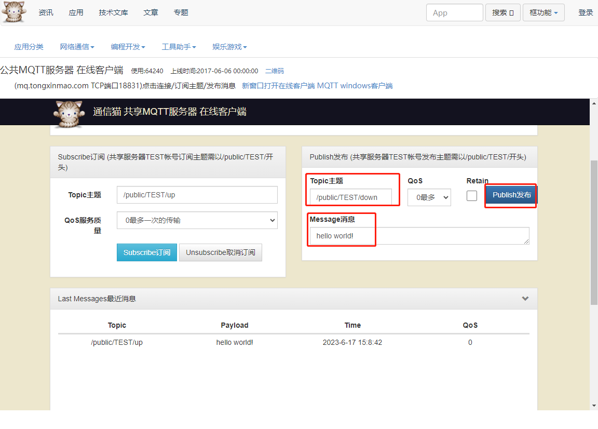

# SimpleDTU上手说明_V1.0

[TOC]

## 一、基本概述

SimpleDTU是一款简单的数据传输单元，支持TCP和MQTT数据纯透传。

本文档旨在指导用户如何基于我司的QuecPython开发板进行SimpleDTU功能开发。

## 二、功能列表

| 功能     | 备注       |
| -------- | ---------- |
| TCP透传  | 单主题透传 |
| MQTT透传 | 单主题透传 |
| 参数配置 | ——         |

## 三、应用指导

### 1、准备工作

硬件准备：

- 一块开发板 (`QuecPython_EC2X_EVB`或者`Open EVB`)
- **USB 数据线** (USB-A TO USB-C)
- **PC** (Windows7 & Windows10 & Windows11)

软件准备：

- 下载安装 **USB驱动**，用于开发调试QuecPython模组
- 下载**调试工具QPYcom ** —— QuecPython全栈式开发调试工具
- 串口调试工具**QCOM** —— 用于模拟MCU。
- 获取下载 **QuecPython** 固件和相关软件资源
- 安装**Python语言**的 **文本编辑器**，例如 [VSCode](https://code.visualstudio.com/)、[Pycharm](https://www.jetbrains.com/pycharm/download/)

驱动、工具、固件等资源下载请访问：https://python.quectel.com/download

### 2、硬件选型

#### 2.1、`Open EVB`开发板

采用`Open EVB`开发板搭载`EC600N-CN-TEA`模组。


> 注意事项：
>
> 1. 在SIM卡座中插入SIM卡。
> 2. 接入天线。
> 3. 使用USB数据线连接开发板至电脑USB接口。
> 4. 通过TTL转USB模块连接串口至PC。

#### 2.2、`QuecPython EVB`开发板

采用搭载了`EC200U`模组的`QuecPython_EC2X_EVB_V2.0`开发板(EC2X开发板介绍：https://python.quectel.com/doc/Quick_start/zh/EC2X_BOARD.html)。

使用type-c给模块供电，UART与TTL转USB模块的连接 ，如下图(仅供参考)。

| 开发板上的PIN脚 | TTL转USB模块 | 图中线的颜色 |
| --------------- | ------------ | ------------ |
| J7的13脚(TX)    | RX           | 红线         |
| J7的14脚(RX)    | TX           | 橙线         |
| J7的3脚(GND)    | GND          | 黄线         |



> 注意事项：
>
> 1. 在SIM卡座中插入SIM卡。
> 2. 接入天线。
> 3. 使用USB数据线连接开发板至电脑USB接口。
> 4. 通过TTL转USB模块连接串口至PC。

### 3、软件准备

#### 3.1、获取实验代码

本实验项目代码仓库：`https://github.com/QuecPython/SimpleDTU`。

#### 3.2、编写配置文件

DTU配置文件路径：`code/dtu_config.json`。

本实验案例，基于mqtt私有云做如下配置：


> 参数说明：
>
> `system_config.config`:  指定当前使用的私有云类型。目前支持tcp和mqtt。
>
> `mqtt_private_cloud_config`: MQTT私有云配置。
>
> `socket_private_cloud_config`: tcp私有云配置。
>
> `uart_config`：串口参数配置。

#### 3.3、下载代码到设备

启动QPYcom调试工具，按如下方式操作。

操作步骤：

- 接上数据线，连接至电脑。
- 短按开发板上的**PWRKEY**按键启动设备。
- 选择并打开串口。
  - `EC600N`模组选择`Quectel USB MI05 COM Port`串口连接。
  - `EC200U`模组选择`Quectel USB NMEA Port`串口连接。
- 选择`下载`标签页，新建项目(名称自定义)，在右侧`/usr`目录下右键选择`一键导入`后选择`code`目录即可一键导入应用脚本代码。


#### 3.4、启动DTU服务

运行`main2.py`启动DTU服务。

> 注意：如果将`main2.py`命名为`main.py`，则模组上电后会自动执行该脚本运行服务。

操作步骤：

- 选择`文件`标签页。
- 选中`main2.py`应用主脚本。
- 在主脚本右键下拉菜单选择`运行`或者点击上方运行快捷按钮，即可运行。


DTU服务中有2个线程处理数据，一个是用于检测读取串口数据并转发数据给云端，一个是检测云端下行数据透传给串口，如下图所示。


### 4、数据透传演示

使用QCOM**串口调试工具模拟**数据透传。

#### 4.1、上行数据透传

使用串口调试工具模拟mcu给模组发送上行数据。

- 在`Input String`输入框中输入`hello world!`字符串。
- 点击`Send Command`按钮通过串口发送数据。


QpyCom日志输出。

- DTU接收串口数据，直接透传。


云端接收上行数据日志。


#### 3.2、下行数据透传

云端发送下行数据。

- 设置云端下行数据主题（与DTU应用配置的订阅主题一致）。
- 输入下行数据。
- 发布。



DTU下行数据日志。


使用串口调试工具模拟mcu接收模组下行数据。


## 四、开发指导

### 1、概述

SimpleDTU是一款简单的数据传输单元，目前支持TCP和MQTT数据纯透传模式。DTU应用有2个核心线程：**上行数据处理线程**、**下行数据处理线程**，应用与云端对象之间数据交换采用**队列**方式解耦。

### 2、应用流程图


> 流程描述：
>
> 1. 读取配置文件: `code/dtu_config.json`。
> 2. 打开串口: 根据配置文件中的`uart_confg`配置参数项打开串口。
> 3. 检查注网：如失败则间隔20s重新检查直至成功。
> 4. 检查拨号：如失败建间隔20s重新拨号直至成功。
> 5. 连接云端：云端在接收到下行消息后会将消息放入一个队列中，待后续业务线程从队列中读取消息。
> 6. 启动业务线程。
>    1. 上行数据处理线程：监听并读取mcu通过串口发送的上行数据，并发送给云端。
>    2. 下行数据处理线程：监听并读取云端队列下行数据，通过串口发送给mcu。

### 3、目录结构

```shell
- code
	- common.py			通用工具
	- dtu.py			DTU应用类实现
	- dtu_config.json	模板配置文件
	- error.py			错误码及描述
	- logging.py		日志
	- main2.py			应用主脚本(demo)
	- mqttIot.py		mqtt客户端实现
	- serial.py			串口读写实现
	- settings.py		配置文件读写实现
	- socketIot.py		tcp客户端实现
```

### 4、简单上手

新建应用主脚本，如`main2.py`。

导入`usr.dtu.DTU`以及`usr.settings.ConfigureHandler`。

使用`ConfigureHandler`构建配置对象（配置文件模板参阅`dtu_config.json`），并作为`DTU`对象的初始化参数，构建DTU对象。再通过DTU对象的run方法，运行实例。

建议编写一个工厂函数来构造DTU应用对象，如下：

```python
from usr.dtu import DTU
from usr.settings import ConfigureHandler


def create_app(config_path):
    config = ConfigureHandler(config_path)
    dtu = DTU(config)
    return dtu


app = create_app('/usr/dtu_config.json')


if __name__ == '__main__':
    app.run()
```

将`main2.py`在内的所有脚本下载进模组并启动应用主脚本即可（参阅第四章：`四、应用指导`）。

### 5、异常代码

如果应用异常，如网络连接中断导致的云端读写错误，会给mcu返回错误信息（json格式），如：`{"code": 1, "desc": "connect error."}`。详细定义见`error.py`模块。

| 错误码 | 描述                     |
| ------ | ------------------------ |
| 0x01   | connect error.           |
| 0x02   | subscribe error.         |
| 0x03   | listen error.            |
| 0x04   | publish error.           |
| 0x05   | network status error.    |
| 0x06   | set socket option error. |
| 0x07   | tcp send data error.     |

## 五、文档汇总

| 文档描述                                  | 链接                                                         |
| ----------------------------------------- | ------------------------------------------------------------ |
| QuecPython官网wiki(包含各种api供开发使用) | https://python.quectel.com/doc/API_reference/zh/index.html   |
| QuecPython入门开发教程                    | https://python.quectel.com/doc/Quick_start/zh/index.html     |
| 资源下载(固件、工具、驱动等)              | https://python.quectel.com/download                          |
| DTU产品介绍                               | https://python.quectel.com/doc/Product_case/zh/dtu/DTU_Product_Introduction.html |
| EC2X开发板介绍                            | https://python.quectel.com/doc/Quick_start/zh/EC2X_BOARD.html |
| EC200U-CN模组介绍                         | https://python.quectel.com/products/ec200u-cn                |

## 六、常见问题

1、串口通信问题。

> Q: 通过TTL转USB模块连接串口至PC后，QCOM串口调试工具无法接收、发送数据。
>
> A: 通常可以采用如下方式检查：
>
> - 检查QCOM是否选择正确的端口打开。
> - 检查接线是否正确，模组RX接TTL转USB设备的TX，模组TX接TTL转USB设备的RX。
> - 应用代码配置的QuecPython串口编号选择是否正确。参阅：`https://python.quectel.com/doc/API_reference/zh/QuecPython_classlib/machine.UART.html`中针对不同的模组，开放的UART列表 。

2、网络问题

> Q: 连接网络异常。
>
> A：可以通过`checkNet`的`waitNetworkReady`函数返回值判定，返回值代表含义详情参阅：`https://python.quectel.com/doc/API_reference/zh/QuecPython_classlib/checkNet.html`

3、MQTT连接异常

> Q: MQTT连接成功后反复重连。
>
> A: 如果存在多个相同id的客户端同时连接，那么服务端会踢掉之前的连接。检查是否存在使用相同客户id连接的情况。
>
> Q: MQTT连接成功但过一段时间就会被服务器踢下线。
>
> A: 检查客户端是否有心跳。不同服务供应商对心跳时间有一定要求，具体根据服务供应商的文档描述设置。